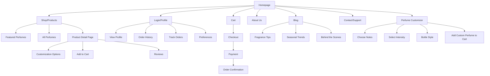
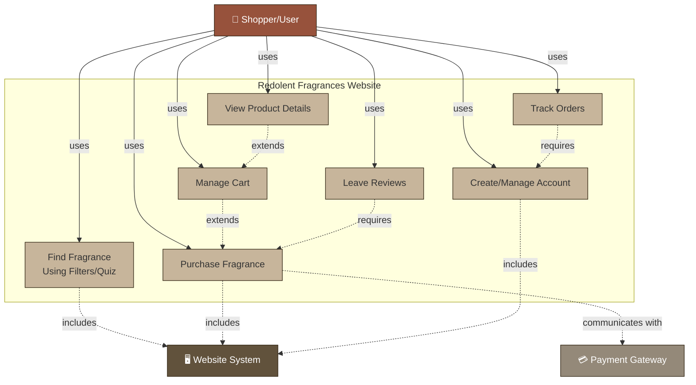
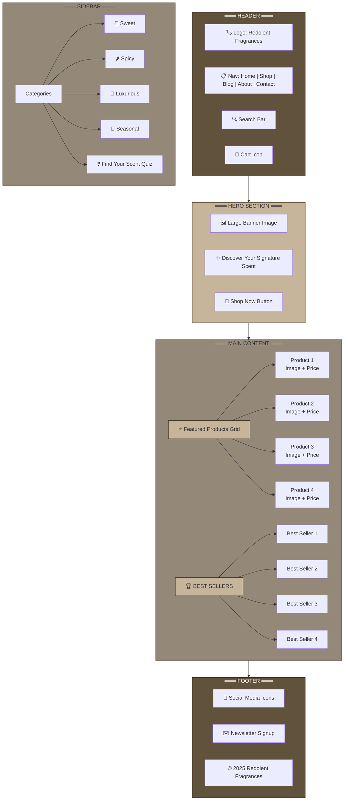

# Team 10: Create a Plan for a Web-Based Business Project

## Company Name
**Redolent Fragrances**

## Mission Statement
Our goal is to provide our customers with perfumes that match their personality and lifestyle so they can define their signature fragrance.

## Services
- Sales and Shipping of Perfume Orders
- Customization of a personal scent perfume using ingredient options
- Suggest complimentary notes that go with primary note
- Suggest fragrances based on previous orders

## Intended Clients
Teenagers to Young Adults

## Design Team Roles
- **Quintin** – Developer / Designer
- **Parag** – Marketer / Usability Expert
- **Alfiya** – Project Manager / Strategist

---

# Team 10: Lab 2

## 1) Work Plans

### a) Bottom-Up Work Plan for the Company Site

#### Brainstorm
Main goal is to sell perfumes as an online seller. Also have Weekly Blogs to show off new content and upcoming sales. As well as selling premade fragrances, we also allow the customization of a personal perfume using provided ingredients (notes).

#### Categorize Content
A simple header acting as a navigation bar would contain options such as the logo, current cart with amount of items inside, and a login button which doubles as a profile button when signed in. A Simple Grid to display the perfumes upon the page, clicking on it would give a description and the ability to add to cart.

#### Critique Content
- Does the Cart display the cost of all items or just quantity of items?
- What information does a profile contain?
- How does the page layout perfumes? (Alphabetically, Popularity, Stock amount)
- Will there be a quick way to add to cart?

#### Revise Content
- The cart shows the quantity but clicking hovering over it will show a simple overview which would show price before taxes and shipping.
- Profile holds information such as note preference, favorite perfume and allows to view past orders and track current orders.
- Perfumes are laid out with a featured lineup at the top then followed by all others ordered by release date (most recent first)
- There will be a button at the bottom of the perfume when hovering over it named 'Add to Cart'.

#### Create Site Map



##### Design Nav Layout

**Main Page**

**Header:**
- Image for the logo
- Text for Company Name
- Button for viewing Cart Contents
- Button for Login/View Profile

**Body:**
- Horizontal Grid for Featured Perfumes
- Grid Containing all Perfumes
- Perfume Cell (Button):
  - Image of Perfume
  - Text for the Price of the Perfume
  - Button to Quick Add to Cart
  - Clicking on the cell will open Perfume Specs.

**Footer:**
- Copyright Information
- Button to Access Perfume Customizer
- Anchor to Return to Top of the Page

#### K.I.S.S.
Keep to a Simple One-Color Scheme. Buttons will be a different color to make it easy to navigate.

#### Develop Pages
Formatting using HTML and CSS. Back-end implemented using JavaScript.

#### Publish Website
Use an FTP client to implement changes and initial website to host machine to ensure website uptime is not affected.

### b) Agile Work Plan for the Company Site

**Iteration 1:**
- **Discover:** Meet with Client and gather project requirements. Figure out what pages you need.
- **Design:** Design a simple layout and find out how you want the web pages to connect together
- **Develop:** Connect the webpages to the main page
- **Test:** Ensure all Connections are working and matches the requirements.

**Iteration 2:**
- **Discover:** Check if new requirements are needed as project requirements could have been changed. Find out what information each user needs to store to design the database
- **Design:** Get each page of the website set-up with simple colors and placeholder images
- **Develop:** Get Main Product Grids working and get a simple login/signup page working as well as adding items to the cart.
- **Test:** Ensure the product cells redirect the items page, and all information is displayed

**Iteration 3:**
- **Discover:** Meet with client to make sure layouts and page connections are working correctly
- **Design:** Add all the items to the website and replace the placeholder images with proper ones
- **Develop:** Add payment systems and ensure it works with the cart and taxes are applied correctly
- **Test:** Ensure Payment systems are working with the cart items. Make sure users made accounts are stored in the database

### c) Comparison of Bottom-Up and Agile Plans

Bottom-up focuses on making a solid foundation before implementing any of the technical components needed to make everything work, it starts with designing the whole website before making any modifications to the website at all.

Agile focuses on making components and small improvements during each iteration, this allows for changes to the plan be made if changes are requested by the client. Doing this allows the client to see the progress of the website as it's developed.

**Conclusion:** I believe that agile would work better than bottom-up as it allows to reduce the overall scope of the development phase allowing us to ensure all bugs are gone and everything is styled as the client needs.

## 2) Values and Vision Statement

### a) Company Values and Measurable Goals

**Values:**
- Luxurious
- Sensual
- Sweet
- Spicy
- Confident
- Timelessness
- Artistry
- Intimacy
- Mystery
- Purity
- Customization

**Measurable Goals:**
- Increase sales by 30% in the first 7 months
- Launch at least 3 seasonal fragrances
- Reduce cart abandonment by 10%
- Increase customer return rate by 30%
- Reduce page load time to 2 seconds

### b) Vision Statement

**Redolent Fragrances will provide a luxurious online shopping experience that attracts 10,000 visitors and achieves a 10% conversion rate within the first year.**

### c) Vision Statement Comparison

**Example:** Our site will be America's most popular online record label, and will earn a minimum of $3,000,000 in music downloads in its first three years

**Analysis:** Both vision statements are clear, specific, and measurable. The example above promises popularity and $3 million in downloads within three years, while Redolent Fragrances commits to 10,000 visitors and 10% conversion in one year. Both are decisive, strong and very specific but ours emphasizes luxury shopping, making it equally strong.

## 3) Strategy and Tactics

### a) Site Strategy

Redolent Fragrances will create an elegant, fast, and emotionally engaging e-commerce experience that emphasizes luxury and intimacy, encourages exploration of fragrance collections, and builds trust through storytelling, reviews, and personalization—ultimately converting at least 10% of visitors into repeat customers.

### b) Tactics and Anti-Tactics

**Developing Tactics:**
1. **Find your scent quiz** - simple multiple-choice questions (mood, occasion, favorite notes) and recommend 1–2 fragrances.
2. **First-time buyer incentive** - offer 20% discount to first time buyers and sign up with email address
3. **Monthly Blog Post** on home page on fragrance tips
4. **Basic Loyalty/Newsletter Signup**

**Anti-Tactics:**
1. Don't overload the site with heavy animations or autoplay videos
2. Don't try to build a huge complex system (like AI product recommendations)

## 4) Site Structure and Content

### a) Products and Services

- Customization of fragrances (choose intensity, notes, or bottle style)
- Variety of scents with filters (luxurious, spicy, sweet, seasonal)
- Personalized suggestions based on browsing or previous orders

### b) Primary and Secondary Functions

**Primary Functions:**
- Browse and purchase fragrances
- Filter/search fragrances (by mood, type, season, or notes)
- User accounts for order tracking

**Secondary Functions:**
- Blog articles with fragrance tips and seasonal stories
- Newsletter signup for promotions and loyalty rewards
- Customer reviews and ratings to build trust

### c) User Tasks and Support

**What users want to do:**
- **Discover fragrances easily** - Supported with filters, categories, and a "Find Your Scent" quiz
- **Learn more about products before buying** - Detailed product pages with descriptions, reviews, and images
- **Buy quickly and securely** - Streamlined checkout process, minimal steps
- **Get personalized suggestions** - Simple "Recommended for You" section or quiz results

### d) Content (Primary and Secondary)

**Primary Content:**
- Product listings (fragrances with descriptions, pricing, customization)
- Shopping cart and checkout process
- Homepage with seasonal highlights

**Secondary Content:**
- Blog posts (fragrance care tips, behind-the-scenes, seasonal trends)
- About Us (brand story, mission)
- Customer reviews and testimonials
- Contact/Support info

### e) Site Architecture (Page Structure)

- **Homepage** - Featured fragrances, seasonal banner, "Find Your Scent" quiz link
- **Shop Page** - Product categories (sweet, spicy, luxurious, seasonal)
- **Product Detail Page** - Customization options, description, reviews, add-to-cart
- **Cart & Checkout** - Secure checkout flow, minimal steps
- **About Us** - Brand values, story, artistry
- **Blog** - Tips, tutorials, seasonal fragrance stories
- **Contact/Support** - FAQs, email form, return policy

### f) Look and Feel (Optional)

**Layout:** Clean, minimalist grid layout with big product images

**Typography:** Elegant serif for headings (luxury), modern sans-serif for body text (readable)

**Color Scheme:** Black, cream/white, and gold accents for luxury feel

**Images:** High-quality fragrance bottles, lifestyle imagery

**Interactive Elements:** Hover effects on products, simple quiz forms, newsletter pop-up

---

# Team 10: Part 0 - Scenarios

## 1. Problem Scenario

Amna loves perfumes but gets overwhelmed by the wide range of choices on the websites. She gets confused by the complex filters and too many choices. She often abandons them in her cart. She needs a website with minimal choices and filters, with great suggestions and customization options available.

## 2. Activity Scenario

Janice comes onto the website to see if there were any new perfumes added to the catalog, seeing that a few were added and are on a limited sale, she adds a few to the cart. After feeling she has gotten what she needed, she enters the cart and proceeds with the checkout. When Janice receives the products she tests them out and feels that one of them matches her perfectly and decides to leave a great review on the perfume.

## 3. Information Design Scenario

Elliot comes onto the website trying to find a new perfume for his wife. He comes on and immediately sees the deals section and looks though a few to see if there's any his wife would like, after looking he decides to look though the popular section to see if any customer rated ones are a good match. He decides after looking in the popular section, he scrolls down and looks at the full catalog. After finding what he's looking for he proceeds with the purchase.

## 4. Interaction Design Scenario

Penny comes into the website and finds she's been signed out of her account, she goes to the navigation bar at the top and clicks on the 'log in' button. After reaching the login page she inputs her username and password and then presses the 'log in' button at the bottom. She then is brought to the main page now showing that she is logged in, and continues down to the sales section and goes through a few rotations of the carousel. She finds a perfume that interests her and decides to click the 'more info' button to look at the full information page. Seeing the reviews she clicks the 'add to cart' button. Then she clicks on the cart icon on the navigation bar and clicks the 'go to cart' button. When reaching the cart page she selects the 'proceed with purchase' button after confirming that the sale price was applied.

## 5. Scenario Review

Read through your four scenarios, in order. When taken as a whole, do the scenarios provide a strong and consistent guideline for the analysis phase (problem scenario) and design phase (activity, information design, and interaction design scenarios) of the project? If not, fine-tune them.

---

# Team 10: Part 1 - Personas

## Primary Persona: Amna Sheik

> "I love perfumes, but I get confused about which one to buy with too many choices in the market."

**Demographics:**
- **Name:** Amna Sheik
- **Age:** 27
- **Job:** Software Engineer

**Likes and Dislikes:**
- Loves technology
- Values good dressing sense and looking presentable
- Dislikes people with a bad odour

**Work Practices & Attitudes:**
- Builds and customizes websites in her professional role
- Prefers simplicity and personalization in online shopping experiences
- Struggles to find the right perfume for different occasions at affordable prices
- Wants fragrance recommendations tailored to her style, mood, and events

## Secondary Persona: Alisha Baig

> "I want perfumes that match my personality, but I don't know which ones are right for me as a teenager."

**Demographics:**
- **Name:** Alisha Baig
- **Age:** 16
- **Occupation:** High School Student

**Likes and Dislikes:**
- Enjoys trendy fashion and social media
- Loves sweet, playful, and light fragrances
- Dislikes strong or overpowering scents
- Gets frustrated with websites that feel "too serious" or boring

**Work Practices & Attitudes:**
- Spends a lot of time browsing on her phone and shopping online with friends
- Influenced by social media trends and celebrity endorsements
- Wants affordable perfumes that still feel stylish and unique
- Needs guidance since she has little fragrance knowledge

## Tertiary Persona: Aryan Khan

> "I want a fragrance that makes me feel confident and leaves a strong impression wherever I go."

**Demographics:**
- **Name:** Aryan Khan
- **Age:** 24
- **Occupation:** Marketing Associate

**Likes and Dislikes:**
- Enjoys socializing, networking, and going out with friends
- Likes bold, masculine, and spicy fragrances
- Dislikes boring product pages with little detail
- Frustrated by expensive options with no affordable alternatives

**Work Practices & Attitudes:**
- Busy professional with limited time to shop in-store
- Sees fragrance as part of his personal brand and confidence
- Wants product recommendations for work, dates, and social events
- Prefers quick, smooth online purchases with clear comparisons

---

# Team 10: Part 2 - Use Cases

## Use Case Diagram



## Critical Tasks

1. Finding the right fragrance (via filters/quiz)
2. Purchasing a fragrance (checkout process)

## Use Case 1: Find the Right Fragrance

**Use Case Name:** Find Fragrance Using Filters/Quiz

**Goal:** Help users quickly find a fragrance that matches their mood, style, or occasion.

**Description:** Users apply filters (sweet, spicy, seasonal) or take a quiz to receive personalized fragrance suggestions.

**Actor(s):** Primary users (shoppers), System (website).

**Preconditions:**
- User is on the website.
- Fragrances are available in the database.

**Main Success Scenario:**
1. User opens "Find Your Scent" tool.
2. User selects filters or answers quiz questions.
3. System generates fragrance recommendations.
4. User views recommended products.

**Extensions:**
- If no fragrance matches → system shows "no exact matches" with closest alternatives.
- If user skips quiz → default popular fragrances displayed.

**Postconditions:**
- User sees personalized fragrance options.
- User may add a product to cart.

### Use Case 1 Scenario

- **Who:** Amna, a 27-year-old software engineer.
- **What:** Uses the fragrance quiz to find a scent for a dinner party.
- **Why:** She struggles to decide among many choices.
- **Where:** At home, browsing on her laptop.
- **When:** Evening, while shopping online after work.
- **How:** She clicks "Find Your Scent," answers mood/style questions, and receives personalized fragrance options.

## Use Case 2: Purchase a Fragrance

**Use Case Name:** Purchase Fragrance

**Goal:** Enable users to complete a fragrance purchase smoothly.

**Description:** Users add fragrance(s) to their cart, proceed to checkout, and complete payment.

**Actor(s):** User, Payment Gateway, System.

**Preconditions:**
- User has a fragrance in their cart.
- Payment gateway is working.

**Main Success Scenario:**
1. User adds fragrance to cart.
2. User proceeds to checkout.
3. User enters shipping and payment details.
4. Payment is processed successfully.
5. Confirmation page is shown with order details.

**Extensions:**
- Payment fails - user is prompted to re-enter details or use another method.
- Out-of-stock item - system notifies user before checkout.

**Postconditions:**
- Order is confirmed.
- User receives an order confirmation email.

### Use Case 2 Scenario

- **Who:** Aryan, a 24-year-old marketing associate.
- **What:** Buys a bold, spicy fragrance for an upcoming networking event.
- **Why:** Wants to make a strong impression.
- **Where:** On his phone during a lunch break.
- **When:** A few days before the event.
- **How:** He filters products, selects one, adds it to cart, enters his payment details, and receives confirmation instantly.

---

# Team 10: Part 1 - Color Schemes

## 1. Color Schemes

### a) Complementary
`{(0, 214, 219), (158, 85, 40), (219, 84, 0), (45, 132, 134), (93, 59, 39)}`

### b) Analogous
`{(219, 116, 94), (219, 115, 0), (219, 77, 0), (219, 0, 0), (222, 221, 220)}`

### c) Monochrome
`{(148, 137, 121), (97, 82, 60), (199, 181, 155), (51, 39, 21), (51, 34, 11)}`

### d) Triadic
`{(0, 75, 219), (206, 217, 182), (219, 33, 0), (134, 58, 45), (46, 62, 92)}`

## 2. Chosen Schemes
Monochrome and Triadic

## 3. Final Choice
I'd choose **Monochrome** as it makes the website look more modern but also looking old school at the same time.

---

# Part 2: Typography and Color Implementation

## 1. Choosing My Typography Scheme

For my shoe store website, I decided to go with a monochrome color palette because it feels elegant and timeless — perfect for showcasing stylish, high-quality shoes. I chose two fonts that complement each other really well:

- **Font 1:** Playfair Display (Headings)
- **Font 2:** Lato (Body/Paragraph)

### Why these fonts?

Playfair Display has a classic, luxury look that gives the site a premium feel. Lato, on the other hand, is clean and modern, which keeps everything readable and balanced. Together, they create a nice mix of elegance and simplicity.

## 2. My Color Palette (Monochrome)

Here's how I used my monochrome tones throughout the site:

| Element | RGB | HEX | USE |
|---------|-----|-----|-----|
| Main Background | (199, 181, 155) | #C7B59B | Warm beige base |
| Headings | (51, 39, 21) | #332715 | Deep brown for bold contrast |
| Body Text | (51, 34, 11) | #33220B | Dark brown for readability |
| Navigation & Footer | (97, 82, 60) | #61523C | Muted tone for structure |
| Buttons / Highlights | (148, 137, 121) | #948979 | Subtle accent color |

This palette gives the site an earthy, classic tone that feels comfortable and trustworthy — a good vibe for a shoe brand.

## 3. First Typography Scheme (Simple Two-Font Design)

- **Headings:** Playfair Display (Bold, 28px)
- **Body Text:** Lato (Regular, 16px)

This version keeps things simple, clean, and elegant — easy to read and visually balanced.

## 4. Second Typography Scheme (More Detailed)

| TEXT TYPE | FONT | STYLE | SIZE |
|-----------|------|-------|------|
| Main Headings | Playfair Display | Bold | 32px |
| Secondary Headings | Lato | Semi-Bold | 20px |
| Sub Headings | Lato | Bold | 18px |
| Main Body | Lato | Regular | 16px |
| Secondary Body | Lato | Regular, lighter tone | 14px |
| Navigation Links | Playfair Display | Regular | 18px |
| Footer / Fine Print | Lato | Italic, muted color | 12px |

This second setup introduces more variation between headings and content, giving the site a more polished, magazine-like style.

## 5. Testing and Final Choice

I tested both typography schemes on a sample webpage. The first scheme (Playfair Display + Lato) looked cleaner and fit better with the overall minimalist feel of the shoe store, so I decided to use that as my final typography system. It feels both stylish and easy to navigate, which is exactly what I wanted.

## 6. Checking Color Accessibility

I used the Accessible Web Color Contrast Checker to make sure my text colors have enough contrast against the background. All my color combinations passed the accessibility test, ensuring everything is readable for users with different visual needs.

## 7. Final Typography and Color Setup (CSS Example)

```css
/* Import Google Fonts */
@import url('https://fonts.googleapis.com/css2?family=Lato:wght@400;700&family=Playfair+Display:wght@700&display=swap');

:root {
    --bg-color: #C7B59B;
    --heading-color: #332715;
    --text-color: #33220B;
    --accent-color: #61523C;
    --highlight-color: #948979;
}

body {
    font-family: 'Lato', sans-serif;
    font-size: 16px;
    color: var(--text-color);
    background-color: var(--bg-color);
    line-height: 1.6;
}

h1, h2, h3 {
    font-family: 'Playfair Display', serif;
    color: var(--heading-color);
}

a {
    color: var(--accent-color);
    text-decoration: none;
}

a:hover {
    color: var(--highlight-color);
}

footer {
    font-size: 12px;
    color: var(--accent-color);
}
```

## 8. Summary

This project helped me understand how much typography affects the overall feel of a website. By combining Playfair Display and Lato with a monochrome color scheme, I was able to design a site that looks elegant, readable, and professional — just like the kind of shoe store I'd personally want to shop at.

---

# Part 3: Homepage Design

## 1. Homepage Elements

### Homepage Wireframe



### Header
- Logo
- Nav bar
- Search bar
- Add to cart

### Hero Section
- Large banner image
- Headline
- "Shop now" button

### Best Seller
- List of 3-4 products

### Aside
- Categories

### Footer
- Social media logos
- Sign up to newsletter
- Copyrights

---

# Lab 6: Organized Content Inventory

Purpose: This section inventories all content and media by page so layout and styling can proceed quickly. Each page lists text, images (filenames + alt/notes), videos, hyperlinks, and forms/CTAs. Proposed filenames are placeholders you can reuse when exporting assets.

Conventions used below
- File structure (proposed):
    - /assets/logo/
    - /assets/icons/
    - /assets/images/hero/
    - /assets/images/products/
    - /assets/images/blog/
    - /assets/images/team/
    - /assets/videos/
- Image naming: kebab-case, brand prefix rf- where helpful. Example: rf-hero-fall-2025.jpg, rf-prod-amber-blossom-01.jpg
- Alt text style: concise, functional, and descriptive of content/action (not repeating surrounding text)
- Color and type: Use palette and typography defined earlier in this doc

## Global Assets (site-wide)

- Logo package
    - rf-logo-primary.svg — Primary horizontal logo (dark on light backgrounds)
    - rf-logo-reverse.svg — Reversed logo (light on dark backgrounds)
    - rf-logomark.svg — Square mark for avatars/favicons
    - favicon.ico — 32x32 ICO
    - apple-touch-icon.png — 180x180
    - site.webmanifest — PWA manifest (name, icons)
- Icons (SVGs in /assets/icons/)
    - cart.svg, search.svg, user.svg, heart.svg, filter.svg, star.svg, share.svg, menu.svg, close.svg, arrow-left.svg, arrow-right.svg
- Utility images
    - rf-placeholder-1x1.png — neutral placeholder
    - rf-badge-sale.svg, rf-badge-new.svg — small product badges

## Homepage

- Text content
    - Headline: "Discover Your Signature Scent"
    - Subhead: "Curated fragrances and custom blends for every mood and moment."
    - Sections: Featured Products, Best Sellers, Categories, Newsletter CTA
    - Button copy: Shop Now, View All, Add to Cart, Read More, Sign Up
- Images
    - /assets/images/hero/rf-hero-fall-2025.jpg — alt: "Perfume bottles on marble with soft light"
    - /assets/images/products/rf-prod-amber-blossom-01.jpg — alt: "Amber Blossom eau de parfum bottle"
    - /assets/images/products/rf-prod-spice-noir-01.jpg — alt: "Spice Noir fragrance bottle"
    - /assets/images/products/rf-prod-rose-velvet-01.jpg — alt: "Rose Velvet fragrance bottle"
    - /assets/images/products/rf-prod-citrus-muse-01.jpg — alt: "Citrus Muse fragrance bottle"
- Videos
    - None for v1 (optional future: short brand loop hero.mp4)
- Hyperlinks
    - Internal: /shop, /product/{slug}, /blog, /about, /contact, /customizer, /quiz
    - External: Instagram, TikTok, Pinterest brand profiles
- Forms/CTAs
    - Newsletter signup (email)
    - Add to Cart on product cards

## Shop / Products

- Text content
    - Page title: "Shop Fragrances"
    - Category labels: Sweet, Spicy, Luxurious, Seasonal
    - Sorting: Featured, Newest, Best Selling, Price Low–High, Price High–Low
    - Filters: Notes, Mood, Intensity, Price range, Availability
- Images
    - Product thumbnails: /assets/images/products/rf-prod-<slug>-01.jpg (primary), -02.jpg (alt angle)
    - Category banners (optional): /assets/images/products/rf-cat-<category>.jpg
- Videos
    - None for v1
- Hyperlinks
    - Internal: /product/{slug}, pagination (/shop?page=n)
    - Breadcrumbs: Home > Shop
- Forms/CTAs
    - Filter controls, sort select, Add to Cart, Quick View (optional), pagination

## Product Detail Page

- Text content
    - Product name, price, volume options (e.g., 30ml/50ml/100ml)
    - Description: top/middle/base notes, mood, longevity, sillage
    - Review snippet (average rating + count), full reviews section
    - Customization section link: "Customize this scent"
    - Shipping/returns highlights
- Images
    - /assets/images/products/rf-prod-<slug>-01.jpg — alt: "<Name> bottle front"
    - /assets/images/products/rf-prod-<slug>-02.jpg — alt: "<Name> bottle angled"
    - /assets/images/products/rf-prod-<slug>-lifestyle.jpg — alt: "<Name> lifestyle photo"
- Videos
    - Optional: /assets/videos/rf-<slug>-overview.mp4 — alt: "Product 360 overview"
- Hyperlinks
    - Internal: /customizer?base=<slug>, related products, reviews anchor #reviews
- Forms/CTAs
    - Variant selector (size), quantity stepper, Add to Cart, Add to Wishlist
    - Review submission form (rating, title, body)

## Perfume Customizer

- Text content
    - Title: "Create Your Custom Blend"
    - Steps: Choose Notes, Select Intensity, Pick Bottle Style, Review & Add to Cart
    - Helper tips (compatibility suggestions, recommended pairings)
- Images
    - /assets/images/customizer/rf-customizer-base-notes.png — alt: "Note selection UI"
    - /assets/images/customizer/rf-bottle-styles.png — alt: "Bottle style options"
    - Dynamic preview (canvas/image) — alt: "Preview of your custom perfume"
- Videos
    - None for v1
- Hyperlinks
    - Internal: back to product, learn more on notes (/blog/tags/notes)
- Forms/CTAs
    - Multi-step form controls, Add Custom Perfume to Cart

## Cart

- Text content
    - Title: "Your Cart"
    - Line items with name, variant, note summary (if custom), price, quantity
    - Subtotal, estimated shipping/tax, discount field
    - Empty state message
- Images
    - Thumbnails for each item: /assets/images/products/rf-prod-<slug>-thumb.jpg
- Videos
    - None
- Hyperlinks
    - Internal: Continue shopping (/shop), Checkout (/checkout)
- Forms/CTAs
    - Update quantities, remove item, apply coupon, proceed to checkout

## Checkout

- Text content
    - Sections: Shipping Address, Delivery Method, Payment, Review Order
    - Trust/information: "Secure checkout", privacy note, return policy link
- Images
    - Card/payment logos (svg): visa.svg, mc.svg, amex.svg, apple-pay.svg, google-pay.svg
- Videos
    - None
- Hyperlinks
    - Internal: /privacy, /returns, /terms
- Forms/CTAs
    - Shipping form (name, address, phone, email)
    - Payment form (card fields or wallet buttons)
    - Place Order button

## Order Confirmation

- Text content
    - Title: "Thank you for your order!"
    - Order number, summary, shipping address, items, totals
    - Next steps: email confirmation, tracking when available
- Images
    - Optional confirmation illustration: /assets/images/illustrations/rf-order-confirmed.png — alt: "Order confirmed"
- Videos
    - None
- Hyperlinks
    - Internal: Track Order (/account/orders/{id}), Continue Shopping (/shop)
- Forms/CTAs
    - Print receipt, Create account (if guest)

## Login / Profile

- Text content
    - Login: email, password, "Forgot password?"
    - Profile: name, email, addresses, preferences (note preference, favorites)
    - Order History and Tracking
- Images
    - Avatar placeholder: /assets/images/avatars/user-default.png — alt: "User avatar placeholder"
- Videos
    - None
- Hyperlinks
    - Internal: /signup, /account/orders, /account/preferences
- Forms/CTAs
    - Login, Sign Up, Update Profile, Add Address, Reset Password

## About Us

- Text content
    - Mission statement, brand story, values (luxury, intimacy, artistry, etc.)
    - Team bios (short)
- Images
    - /assets/images/brand/rf-studio.jpg — alt: "Fragrance studio workspace"
    - /assets/images/team/rf-team-01.jpg — alt: "Redolent Fragrances team photo"
- Videos
    - Optional brand reel: /assets/videos/rf-brand-reel.mp4
- Hyperlinks
    - Internal: /blog, /contact
- Forms/CTAs
    - None (optional Join Newsletter)

## Blog

- Text content
    - List of posts: title, excerpt, date, tag (Fragrance Tips, Seasonal Trends, Behind the Scenes)
    - Post detail: headings, paragraphs, captions
- Images
    - /assets/images/blog/rf-blog-<slug>-hero.jpg — alt: "Blog hero image"
    - Inline images per post: rf-blog-<slug>-01.jpg, -02.jpg
- Videos
    - Optional embedded how-to video links (YouTube/Vimeo URL)
- Hyperlinks
    - Internal: /blog/{slug}, tags /blog/tags/{tag}
    - External: cited resources when applicable
- Forms/CTAs
    - Newsletter signup, Share buttons

## Contact / Support

- Text content
    - Contact heading, short intro
    - FAQs (shipping, returns, care)
    - Support email, response time
    - Return policy summary
- Images
    - Optional: /assets/images/brand/rf-support.jpg — alt: "Customer support desk"
- Videos
    - None
- Hyperlinks
    - Internal: /returns, /privacy, /faq (if separate)
    - External: mailto:support@redolentfragrances.example
- Forms/CTAs
    - Contact form (name, email, order # optional, message)

## Find Your Scent Quiz (if standalone page)

- Text content
    - Intro: "Answer a few quick questions to get your scent match"
    - Questions: Occasion, Mood, Preferred Notes, Season, Intensity
    - Results title: "Your Top Matches"
- Images
    - Small note icons: floral.svg, woody.svg, citrus.svg, spicy.svg
- Videos
    - None
- Hyperlinks
    - Internal: Results anchor, linked products, link to customizer
- Forms/CTAs
    - Start Quiz, View Results, Add Recommended to Cart

---

Acceptance check
- Pages covered match sitemap (Homepage, Shop, Product Detail, Customizer, Cart, Checkout, Order Confirmation, Login/Profile, About, Blog, Contact/Support, Quiz)
- For each page: text, images (with filenames + alt), videos, hyperlinks, forms/CTAs are listed
- Global assets and conventions included (logo, icons, naming)
